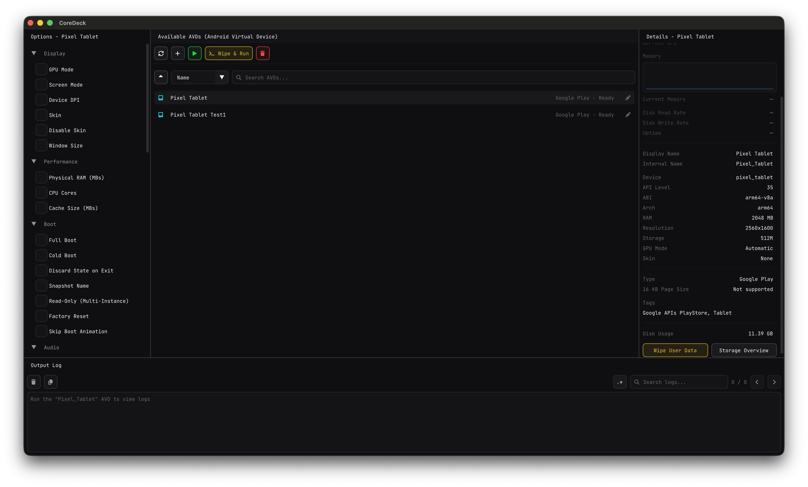
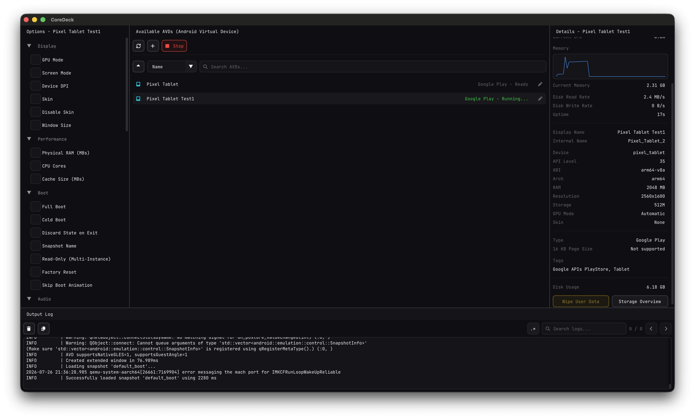
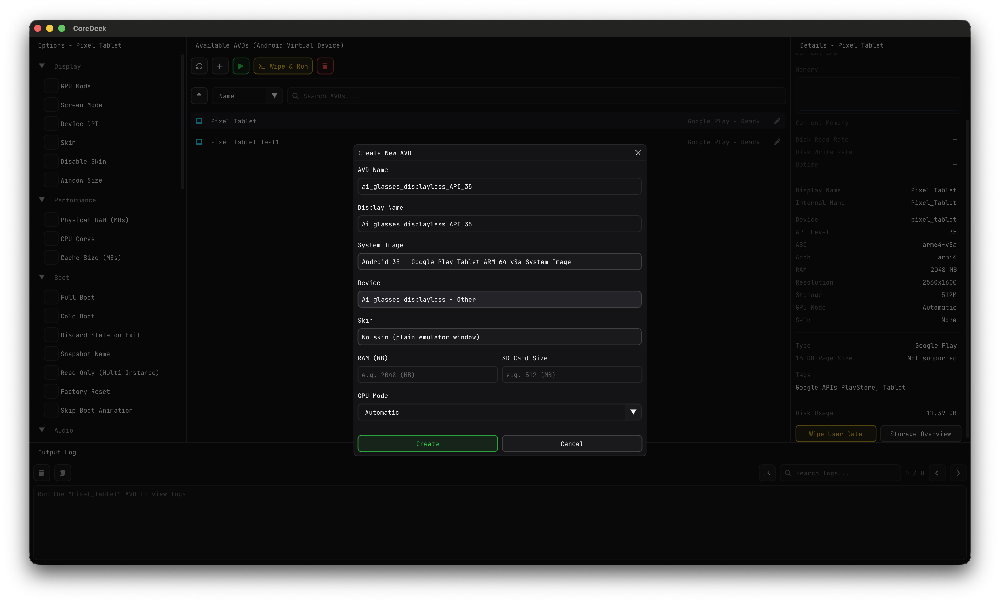
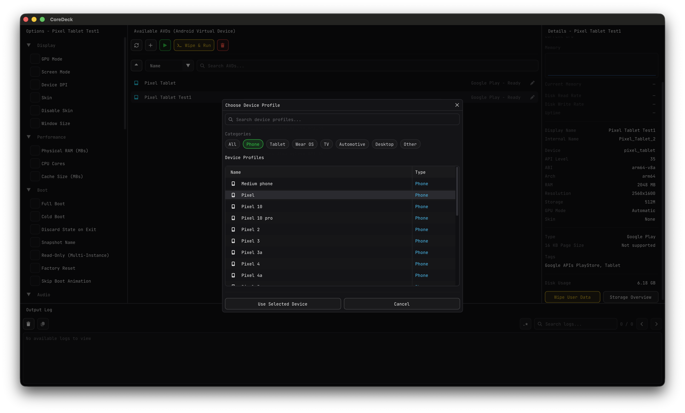
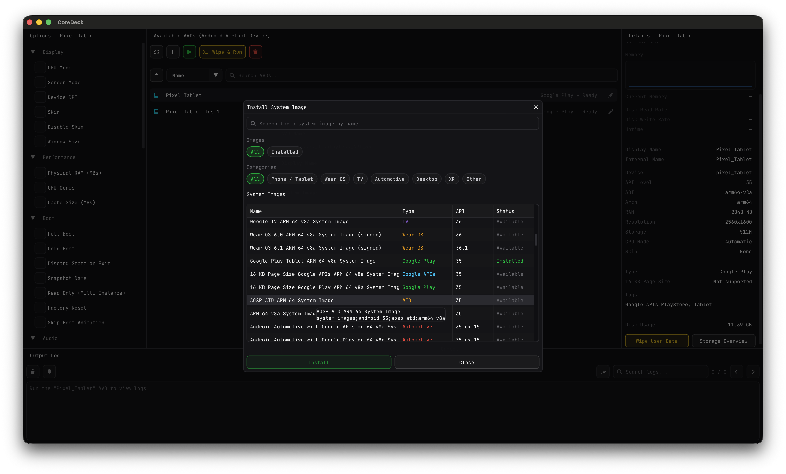
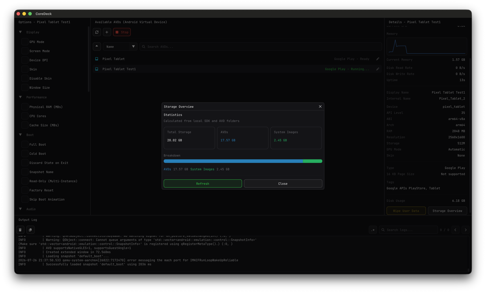

<div align="center">
  
  <br /><br />
  <a href="https://www.producthunt.com/products/coredeck?embed=true&amp;utm_source=badge-featured&amp;utm_medium=badge&amp;utm_campaign=badge-coredeck" target="_blank" rel="noopener noreferrer"></a>
</div>

<br />

[](https://github.com/kangaroo1122/CoreDeck/actions/workflows/build.yml)
[](https://github.com/kangaroo1122/CoreDeck/actions/workflows/release.yml)
[](https://github.com/kangaroo1122/CoreDeck/releases)
[](https://github.com/kangaroo1122/CoreDeck/releases)
[](https://github.com/kangaroo1122/CoreDeck/releases)
[](https://github.com/kangaroo1122/CoreDeck/stargazers)
[](https://github.com/kangaroo1122/CoreDeck/issues)


[](LICENSE)

[CoreDeck](https://github.com/kangaroo1122/CoreDeck) is an open source native desktop application around your Android SDK's official
emulator, adb, avdmanager, and sdkmanager tools. It gives you one focused GUI for AVD management, SDK packages,
emulator launch options, live logs, device file browsing, storage inspection, and per-AVD shared folders without opening
Android Studio for everyday emulator work. Built with C++20 and Dear ImGui.

> [!IMPORTANT]
> You still need an Android SDK. CoreDeck can guide first-run SDK setup and install the base command-line tools, or use
> an SDK already installed by Android Studio.

<div align="center">
  <video src="https://github.com/user-attachments/assets/cade70a8-c7b4-47ac-98c1-6b8986893dcc" controls width="720"></video>
</div>

## Features

- **AVD Management** — Create, rename, delete, sort, search, and inspect Android Virtual Devices.
- **Emulator Control** — Launch, stop, cold boot, wipe & run, and tune per-AVD emulator options such as GPU, RAM, CPU, camera, network, boot, and timezone.
- **SDK Package Management** — Install and remove Android SDK platforms, system images, platform-tools, emulator, and command-line tools from Preferences.
- **Guided SDK/JDK Setup** — Configure an existing SDK, install base SDK tools during onboarding, and use a managed JDK 17+ without changing system Java.
- **Device Explorer** — Browse files on the selected running AVD, upload/download files or folders, create folders, and delete safely.
- **Per-AVD Shared Folders** — Open host or emulator shared folders and sync regular files incrementally with conflict-preserving copies.
- **Output Log Viewer** — Stream emulator output with search, navigation, selectable text, auto-scroll, and horizontal scrolling for long lines.
- **Five-Panel Workspace** — Toggle AVDs, Options, Details, Output Log, and Device Explorer independently with persisted split ratios.
- **Storage Overview** — Inspect per-AVD disk usage and clear heavy or unused data.
- **Preferences & Localization** — Switch theme/language, choose CJK UI fonts, adjust font size, and restore window size/maximized state across restarts.

## Preview

|                                AVD List & Options                                 |                                    Running Emulator & Logs                                    |
| :-------------------------------------------------------------------------------: | :-------------------------------------------------------------------------------------------: |
|  |  |
|                 _Browse AVDs with per-device options and details_                 |                 _Launch emulators and inspect logs, status, and running output_               |

|                                 Create New AVD                                 |                                  Device Profile Selection                                   |
| :----------------------------------------------------------------------------: | :-----------------------------------------------------------------------------------------: |
|  |  |
|              _Configure system image, device, RAM, and GPU mode_               |                    _Pick from a rich catalog of Android device profiles_                    |

|                                         System Image Browser                                          |                                    Storage Overview                                    |
| :---------------------------------------------------------------------------------------------------: | :------------------------------------------------------------------------------------: |
|  |  |
|                           _List, install, and remove Android system images_                           |                     _Inspect AVD disk usage and clear heavy data_                      |

## Downloads

Grab the latest prebuilt binaries from the [Releases](https://github.com/kangaroo1122/CoreDeck/releases) page:

| Platform | Architecture          | File            |
| -------- | --------------------- | --------------- |
| Windows  | x86-64                | `.msi` / `.zip` |
| macOS    | arm64 (Apple Silicon) | `.dmg`          |
| Linux    | x86-64, arm64         | `.tar.gz`       |

Each release artifact ships with a matching `.sha256` checksum for download verification.

## Requirements

- **Android SDK** with `cmdline-tools`, `platform-tools`, and `emulator` installed, or an empty directory where CoreDeck can install the base SDK tools.
- **Java/JDK 17+** is recommended for modern Android SDK tools. CoreDeck can use a configured JDK home or download a managed user-local JDK.
- **OS:** Windows 10/11, macOS 12+ (Apple Silicon), or a recent Linux distribution.

## Build from source

CoreDeck builds with **CMake + Ninja** on all platforms. Output is single-config: `build-debug/` and `build-release/` contain the binary directly, with a `compile_commands.json` for editor tooling.

### Prerequisites

All platforms need **CMake 3.23+**, **Ninja**, and **Git** (with submodule support). Per-platform compiler:

| Platform | Compiler              | Install                                                                                                                                                                     |
| -------- | --------------------- | --------------------------------------------------------------------------------------------------------------------------------------------------------------------------- |
| macOS    | Apple Clang           | `xcode-select --install`, then `brew install cmake ninja`                                                                                                                   |
| Windows  | MSVC 19.30+ (VS 2022) | [Build Tools for VS 2022](https://visualstudio.microsoft.com/downloads/) → _Desktop development with C++_ workload. Then `winget install Kitware.CMake Ninja-build.Ninja`   |
| Linux    | GCC 11+ / Clang 14+   | `sudo apt-get install build-essential cmake ninja-build libcurl4-openssl-dev libgl1-mesa-dev libx11-dev libxrandr-dev libxinerama-dev libxcursor-dev libxi-dev libxext-dev` |

### Clone and build

```bash
git clone --recursive https://github.com/kangaroo1122/CoreDeck.git
cd CoreDeck
cmake -S . -B build-release -G Ninja -DCMAKE_BUILD_TYPE=Release
cmake --build build-release --parallel
```

If you already cloned without `--recursive`:

```bash
git submodule update --init --recursive
```

> **Windows note:** Ninja + MSVC needs `cl.exe` on PATH. Run the commands from the **Developer Command Prompt for VS 2022** (Start Menu), or launch VS Code / Cursor from it so the bundled tasks pick up the environment. The provided VS Code tasks handle this automatically via `vswhere` + `Enter-VsDevShell`.

### Run

```bash
# macOS
open build-release/CoreDeck.app

# Linux
./build-release/CoreDeck

# Windows
.\build-release\CoreDeck.exe
```

### Develop in VS Code or Cursor

The repo ships pre-configured `.vscode/` settings (build tasks, launch configs, IntelliSense). Open the project, accept the recommended extensions when prompted, then press **F5** to build and debug.

**Per-editor extensions** — the two editors use different language servers and debuggers:

| Editor                      | Install                                                        | Purpose                                                                           |
| --------------------------- | -------------------------------------------------------------- | --------------------------------------------------------------------------------- |
| **VS Code**                 | `ms-vscode.cpptools`, `ms-vscode.cmake-tools`                  | IntelliSense + CMake integration + `cppvsdbg` (Microsoft MSVC debugger)           |
| **VS Code** _(optional)_    | `vadimcn.vscode-lldb`                                          | Adds LLDB debugger as an alternative to MSVC                                      |
| **Cursor**                  | `llvm-vs-code-extensions.vscode-clangd`, `vadimcn.vscode-lldb` | clangd IntelliSense + LLDB debugger (Microsoft's `cppvsdbg` is locked to VS Code) |
| **Cursor** _(Windows only)_ | LLVM toolchain — `winget install LLVM.LLVM`                    | Provides the `clangd.exe` binary for the extension                                |

**Launch configurations** in the Run & Debug panel:

| Name                                | Editors           | Debugger        |
| ----------------------------------- | ----------------- | --------------- |
| `CoreDeck (Debug) [macOS]`          | VS Code or Cursor | `cppdbg` + LLDB |
| `CoreDeck (Debug) [Windows · MSVC]` | VS Code only      | `cppvsdbg`      |
| `CoreDeck (Debug) [Windows · LLDB]` | VS Code or Cursor | CodeLLDB        |

Each has a matching Release entry and `CoreDeck Tests (...)` variant for the Catch2 test suite. Cursor on Windows should pick the `LLDB` entries; VS Code on Windows can pick either (MSVC is the better PDB-aware option when available).

The first build is a full from-scratch compile of all bundled dependencies (sentry-native, Dear ImGui, GLFW, reflect-cpp, etc.). Subsequent builds are incremental and fast.

## FAQ

**The app starts but says my Android SDK isn't detected.**
CoreDeck looks at `ANDROID_HOME` / `ANDROID_SDK_ROOT`, standard install paths, and any SDK path saved through onboarding
or Preferences. The selected SDK should contain `cmdline-tools`, `platform-tools`, and `emulator`; if the tools are
missing, CoreDeck can install the base packages from the Android SDK preferences.

**An emulator won't launch / boots forever.**
Make sure the matching system image is installed and that hardware acceleration is enabled (Windows Hypervisor Platform
or Hyper-V on Windows, Hypervisor.framework on macOS, KVM on Linux). The live log viewer usually shows the underlying error from `emulator`.
If Quick Boot restores stale device state, enable the per-AVD Cold Boot option.

**Does CoreDeck replace Android Studio?**
No — it wraps the same official command-line tools that Android Studio uses, so you still need the Android SDK
installed. CoreDeck just gives you a focused GUI for SDK, AVD, emulator, logs, device files, and shared-folder workflows.

## Contributing

See [CONTRIBUTING.md](CONTRIBUTING.md) for the branching model, PR guidelines, and how to get started.

## Acknowledgements

CoreDeck is built on top of these excellent open source projects:

- [Dear ImGui](https://github.com/ocornut/imgui) — immediate-mode GUI
- [GLFW](https://github.com/glfw/glfw) — windowing and input
- [reflect-cpp](https://github.com/getml/reflect-cpp) — reflection and serialization
- [tinyfiledialogs](https://sourceforge.net/projects/tinyfiledialogs/) — native file dialogs
- [Catch2](https://github.com/catchorg/Catch2) — testing framework
- [sentry-native](https://github.com/getsentry/sentry-native) — crash reporting

## License

See [LICENSE](LICENSE) for details.
